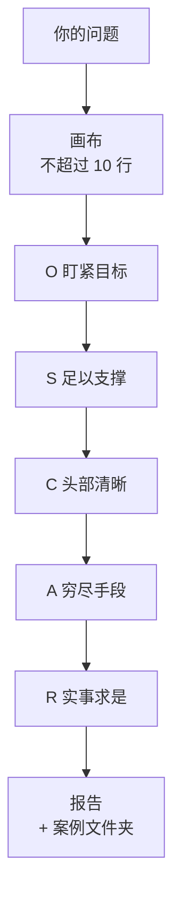

<h1 align="center">OSCAR 调研</h1>

<p align="center"><strong>帮你看清一家公司、一个产品、一个人到底是靠什么做成的，以及你能学什么、不能照搬什么。</strong></p>

<p align="center">
  
  <a href="LICENSE"></a>
  
  
  
  
  
  
</p>

<p align="center">
  <a href="#这是什么">这是什么</a> ·
  <a href="#你会拿到什么">你会拿到什么</a> ·
  <a href="#安装">安装</a> ·
  <a href="#怎么用">怎么用</a> ·
  <a href="#五步是怎么做的">五步是怎么做的</a> ·
  <a href="#常见问题">常见问题</a> ·
  <a href="CHANGELOG.md">版本记录</a> ·
  <a href="README_EN.md">English</a>
</p>

---

## 这是什么

一个给 AI 用的调研说明书（skill）。装好以后，你对 AI 说「调研一下 XX」，它就按固定的五步去查，最后交给你一份结构固定的报告。

它想解决的是 AI 调研常见的三个问题：

| 常见问题 | 这个 skill 的做法 |
|---|---|
| 把官网和新闻重新排一遍，你自己看十分钟也能知道 | 每份报告必须有「你可能没看到的」，写 2 到 4 条看官网看不出来、而且会改变你决定的事 |
| 分不清哪句是查到的、哪句是对方吹的、哪句是 AI 编的 | 每句重要的话带来源编号，标五种靠谱程度之一；没核实的不能拿来下结论 |
| 只说「它用了 AI 所以成功」，说不出真正原因 | 「实事求是」一步连问为什么，问到换个人来做结果也一样的那个原因；还要找一个做失败的来对比 |
| 替你拍板，或者只给一个答案 | 先给不超过 10 行的画布让你看清查什么；最后把每个选项连同证据有几成摆出来，由你来定 |

它不是什么：

- 不是资料汇总。查到的东西只有能改变你决定的才进报告。
- 不替你定产品。方向只写到「试什么、看到什么结果说明不行」。
- 不编试用体验。没注册、没用过，就写没用过。

## 你会拿到什么

先是一份不超过 10 行的画布（这次查什么、不查什么、比较谁），然后是一份结构固定的报告。报告先给结论，后给细节，只读每节第一句也能看懂。

| 小节 | 写什么 |
|---|---|
| 结论 | 三句：一个具体的人和场景 / 它做成主要靠什么 / 对你意味着什么 |
| 画布 | 决策题、成功标准、本轮不做、主攻深度、比较对象、你原来的想法 |
| 你可能没看到的 | 2 到 4 条，每条带证据、靠谱程度、会改变你的哪件事 |
| 钱和人怎么流动 | 谁付钱给谁，外加一笔粗算的账 |
| 它为什么做成了（或没做成） | 五个问题，一直问到真正的原因 |
| 拿来比的几家 | 对比表，至少有一个做失败的 |
| 决策题的几个选项 | 每个选项的条件、成本、风险、证据有几成 |
| 关键判断 | 不超过 3 条，每条附证据 |
| 反论和最大风险 | 最强的反证，以及看什么信号判断对错 |
| 缺口和下一步 | 还不知道的，和一个两周内能做的小验证 |
| 来源 | 编号、链接、日期、靠谱程度，以及这次怎么查的 |

完整示例：[examples/delphi-ai.md](examples/delphi-ai.md)（调研 Delphi.ai，一个把专家做成 AI 分身的平台；这份是正式版之前的试跑稿，小节比现在的模板少几节）。
报告模板：[references/report-template.md](references/report-template.md)。

**查人**（老师、创作者、个人账号）走单独的方法：先拉出对方作品的数据，比较火的和不火的差在哪，封面、标题、内页一项一项配原图拆，最后分「直接拿来用、改了再用、只学思路、不要学」四类。报告模板见 [references/person-report-template.md](references/person-report-template.md)。

**保护你的账号。** 小红书、抖音这类平台会封批量读取的账号。这个 skill 默认不用你登录的账号去读这些平台，先用公开网页、你发来的截图或第三方数据；必须用登录账号时会先问你，一次最多 15 个页面、每页间隔 10 到 20 秒；页面一直加载或提示账号异常就马上停。规则见 [references/account-safety.md](references/account-safety.md)。

## 安装

### 第一步：下载到本机

```bash
git clone https://github.com/ricober33/oscar-research.git ~/.agents/skills/oscar-research
```

### 第二步：装到你用的 AI 客户端

```bash
bash ~/.agents/skills/oscar-research/scripts/install.sh
```

脚本会找出你电脑上装了哪些客户端，在每个客户端的 skill 文件夹里放一条指向这个仓库的链接。所有客户端读的都是同一份文件，不会出现这边改了那边没改。

| 客户端 | skill 文件夹 |
|---|---|
| Claude Code | `~/.claude/skills/` |
| Codex | `~/.codex/skills/`，以及共享的 `~/.agents/skills/` |
| Zcode | `~/.zcode/skills/` |
| Cursor | `~/.cursor/skills/` |
| Antigravity | `~/.gemini/config/skills/`、`~/.gemini/antigravity-cli/skills/` |

没装的客户端会自动跳过。同名的旧文件夹会改名备份，不会删除。

### 第三步：检查

```bash
bash ~/.agents/skills/oscar-research/scripts/check.sh
```

每个客户端一行，显示「✓ 同一份」才算装好。装好后重新开一个对话，客户端才会读到新 skill。

### 网页里的 AI（Grok、ChatGPT、Gemini 等）

这些 AI 读不了你电脑上的文件夹。运行：

```bash
bash ~/.agents/skills/oscar-research/scripts/build-single-file.sh
```

会生成 `dist/oscar-research-单文件版.md`，把整段内容粘进它的自定义指令或项目说明里。skill 更新后要重新生成、重新粘贴。

### 更新

```bash
cd ~/.agents/skills/oscar-research && git pull
```

所有本机客户端同时更新。

## 写上你的背景（建议）

报告里「对你意味着什么」写得准不准，取决于 AI 知不知道你在做什么。

```bash
cd ~/.agents/skills/oscar-research
cp my-context.example.md my-context.md
```

然后打开 `my-context.md`，写上：你在做哪几件事、在哪个国家或地区做生意、说话上有什么要求、案例存在哪里。这个文件只留在你电脑上，不会上传 GitHub。

## 怎么用

直接用平常说话的方式提：

> 调研一下 Delphi.ai，我想知道它哪一步值得我学。

> 帮我盯一下 XX 公司最近在干什么，它是不是在抢我的客户。

> 我觉得做 XX 能赚钱，帮我查查这个想法对不对。

不需要说「用 OSCAR」，说调研、研究、拆解、查一下、竞品、学标杆、盯对手、值不值得做都会触发。说「继续」「深挖」「下一轮」，会从上一轮没查清的地方接着查。想明确指定，可以说「用 oscar-research 调研 XX」。

一次完整调研要上网查很多页面，通常需要十几分钟。

## 五步是怎么做的



| 步 | 叫什么 | 做什么 |
|---|---|---|
| — | 画布 | 不超过 10 行：这次查什么、不查什么、比较谁。不等你回复就接着做，你随时可以改 |
| O | 盯紧目标 | 把「了解一下」改成一道选择题：决策题、成功标准、本轮不做；写下你现在默认相信什么 |
| S | 足以支撑 | 七层深度只主攻一层；分出必看、可看可不看、明确不看 |
| C | 头部清晰 | 直接竞品、间接竞品、借鉴产品、做失败的；头部一个不漏，国外对象配一个国内同类 |
| A | 穷尽手段 | 官网 → 以前的页面 → 真实用户 → 反面搜索 → 招聘 → 研报 → 政策 → 原文；打不开的写明原因 |
| R | 实事求是 | 连问为什么，问到真正的原因；再交选项、关键判断、反论和风险、缺口和下一步 |

**七层深度**，每次只主攻一层：SOP（一个具体做法）、ROI（投入和回报）、业务公式（收入由哪几个数相乘）、单元模型（一个客户带来多少钱）、商业模式（谁付钱）、完整公司、行业。

**八条铁律**，高于一切方法：绝不虚报、说人话、不替你定方向、不为流程加戏、过往当参考不当论据、只认本人原话、证据分级、冲突不抹平。

**五种靠谱程度：**

| 标记 | 意思 |
|---|---|
| 已核实 | 打开过原文，页面本身就证明了这句话；或两个互不相关的来源一致 |
| 只有一个来源 | 一个没有利益关系的来源说的 |
| 只有对方自己说 | 对方自称的业绩、效果、用户数，包括它的合作方和员工给的数字 |
| 有利益关系的人说的 | 竞争对手、投资人、拿推荐佣金的人写的 |
| 没核实 | 凭记忆、只看到搜索摘要、页面已经没了 |

详细规则都在 [SKILL.md](SKILL.md) 里，用大白话写的，可以直接读。

## 仓库里有什么

| 文件 | 用途 |
|---|---|
| [`SKILL.md`](SKILL.md) | skill 本体，AI 读的就是它 |
| [`references/report-template.md`](references/report-template.md) | 报告模板，所有平台按同一个结构输出 |
| [`references/person-research.md`](references/person-research.md) | 查人（老师、创作者、个人账号）时的分析方法 |
| [`references/person-report-template.md`](references/person-report-template.md) | 查人的报告模板 |
| [`references/account-safety.md`](references/account-safety.md) | 保护你的平台账号：读小红书、抖音这类平台时的限制 |
| [`examples/delphi-ai.md`](examples/delphi-ai.md) | 一份完整的示例报告 |
| [`my-context.example.md`](my-context.example.md) | 个人背景模板，复制成 `my-context.md` 再改 |
| [`scripts/install.sh`](scripts/install.sh) | 装到本机所有客户端 |
| [`scripts/check.sh`](scripts/check.sh) | 检查每个客户端读到的是不是同一份 |
| [`scripts/build-single-file.sh`](scripts/build-single-file.sh) | 生成给网页 AI 粘贴的单文件版 |
| [`scripts/lint.sh`](scripts/lint.sh) | 发布前的格式检查，GitHub 上每次提交自动运行 |
| [`CHANGELOG.md`](CHANGELOG.md) | 版本记录 |

## 常见问题

**不同平台跑出来的报告会一模一样吗？**
结构会一样：小节、顺序、来源表、靠谱程度的标法都是固定的，`check.sh` 也能确认每个平台读的是同一份说明。内容不会逐字一样：不同的 AI 模型、不同的上网工具，查到的页面和写法会有差别。要比较两份报告，就一节一节对着看。

**AI 说某个页面打不开，是真的吗？**
skill 要求它写清是哪种打不开（要注册、地区限制、页面没了、连不上），并换一种方式再试一次。它还要求：说「某页面上没有某内容」之前，必须看过页面全文，不能只看抓取工具给的摘要。这一条是试跑时真出过错之后加的。

**同一个对象能查第二次吗？**
能。它会先读上一轮的报告，从没查清的地方开工，报告开头先写上次哪句错了。你做完上次建议的小验证，告诉它结果，它会写进新一轮。

**调研结果存在哪？**
每一轮一个文件夹 `<案例名>-<日期>/`，里面四个文件：`canvas.md`（画布）、`facts.md`（事实库，一条一行带来源）、`report.md`（报告）、`sources.md`（来源清单）。位置在 `my-context.md` 里设，默认 `~/Documents/research-expert/`。

**报告太长？**
先读「结论」和「你可能没看到的」两节就够做决定。后面的小节是给你核对用的。

## 版本记录

见 [CHANGELOG.md](CHANGELOG.md)。

## 许可证

[MIT](LICENSE)。可以自由使用、修改和分发。
